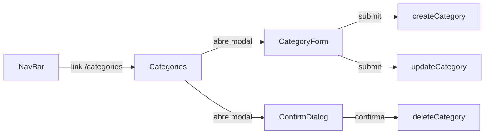

# Design Document — Category Management

## Overview

Esta feature adiciona uma página dedicada (`/categories`) ao StudyFlow para gerenciamento completo de categorias. O usuário pode criar, visualizar, editar e excluir categorias, com indicação visual de cor e contagem de módulos associados.

A implementação reutiliza componentes e hooks já existentes (`CategoryForm`, `useCategories`, `useContents`) e segue os padrões estabelecidos no projeto: React + TypeScript, Tailwind CSS, TanStack Query para estado servidor, Zustand para estado de autenticação, e Supabase como backend.

---

## Architecture

A feature segue a arquitetura em camadas já adotada no projeto:

```
┌─────────────────────────────────────────────────────┐
│                   Pages Layer                        │
│   Categories.tsx  (nova página /categories)          │
└────────────────────┬────────────────────────────────┘
                     │ usa
┌────────────────────▼────────────────────────────────┐
│                Components Layer                      │
│   CategoryCard.tsx  (novo)                           │
│   CategoryForm.tsx  (existente — reutilizado)        │
│   ConfirmDialog.tsx (novo — modal de confirmação)    │
└────────────────────┬────────────────────────────────┘
                     │ usa
┌────────────────────▼────────────────────────────────┐
│                  Hooks Layer                         │
│   useCategories.ts  (existente — reutilizado)        │
│   useContents.ts    (existente — para contagem)      │
└────────────────────┬────────────────────────────────┘
                     │ usa
┌────────────────────▼────────────────────────────────┐
│               Data Layer (Supabase)                  │
│   categories table  (RLS: auth.uid() = user_id)      │
│   contents table    (para contagem por category_id)  │
└─────────────────────────────────────────────────────┘
```

### Fluxo de navegação



### Integração com roteamento existente

A rota `/categories` é adicionada dentro do bloco `ProtectedRoute > AppLayout` em `App.tsx`, seguindo o mesmo padrão das rotas existentes. O link é adicionado ao array `NAV_LINKS` em `NavBar.tsx`.

---

## Components and Interfaces

### `Categories` (página — `src/pages/Categories.tsx`)

Página principal. Gerencia o estado local de UI (qual modal está aberto, qual categoria está sendo editada/excluída).

```typescript
// Estado local da página
type PageState =
  | { mode: "idle" }
  | { mode: "creating" }
  | { mode: "editing"; category: Category }
  | { mode: "deleting"; category: Category };
```

Responsabilidades:
- Renderizar a lista de `CategoryCard`
- Controlar abertura/fechamento dos modais de criação, edição e exclusão
- Exibir estado vazio e estado de carregamento

### `CategoryCard` (novo — `src/components/categories/CategoryCard.tsx`)

Exibe uma categoria individual na listagem.

```typescript
interface CategoryCardProps {
  category: Category;
  moduleCount: number;
  onEdit: (category: Category) => void;
  onDelete: (category: Category) => void;
}
```

Exibe: swatch de cor, nome, contagem de módulos, botões de editar e excluir.

### `ConfirmDialog` (novo — `src/components/ui/ConfirmDialog.tsx`)

Modal de confirmação genérico, reutilizável.

```typescript
interface ConfirmDialogProps {
  open: boolean;
  title: string;
  description: string;
  warning?: string;       // aviso opcional (ex: módulos perderão associação)
  confirmLabel?: string;
  onConfirm: () => void;
  onCancel: () => void;
  isLoading?: boolean;
}
```

### `CategoryForm` (existente — reutilizado sem alterações)

Já suporta criação e edição via prop `category?: Category`. Recebe `onSuccess` para fechar o modal após operação bem-sucedida.

### Alterações em arquivos existentes

| Arquivo | Alteração |
|---|---|
| `src/App.tsx` | Adicionar `import { Categories }` e `<Route path="/categories" element={<Categories />} />` |
| `src/components/ui/NavBar.tsx` | Adicionar `{ to: "/categories", label: "Categorias" }` ao array `NAV_LINKS` |

---

## Data Models

### `Category` (existente em `src/types/index.ts`)

```typescript
export interface Category {
  id: string;
  userId: string;
  name: string;   // 1–50 caracteres
  color: string;  // hex da paleta predefinida (10 cores)
}
```

Nenhuma alteração no tipo é necessária.

### Contagem de módulos por categoria

A contagem de módulos associados a cada categoria é derivada client-side a partir dos dados já carregados pelo hook `useContents`. Não é necessária uma query adicional ao banco.

```typescript
// Derivação da contagem dentro da página Categories
const { data: contents = [] } = useContents();

const moduleCountByCategory = useMemo(() =>
  contents.reduce<Record<string, number>>((acc, content) => {
    if (content.categoryId) {
      acc[content.categoryId] = (acc[content.categoryId] ?? 0) + 1;
    }
    return acc;
  }, {}),
  [contents]
);
```

Decisão de design: usar dados já em cache (TanStack Query) em vez de uma query SQL com `GROUP BY` evita uma requisição extra e mantém consistência com o estado local.

### Schema do banco (sem alterações)

```sql
-- Tabela categories (já existente)
CREATE TABLE categories (
  id      uuid PRIMARY KEY DEFAULT gen_random_uuid(),
  user_id uuid NOT NULL REFERENCES auth.users(id) ON DELETE CASCADE,
  name    text NOT NULL CHECK (char_length(name) <= 50),
  color   text NOT NULL
);

-- RLS já configurada
CREATE POLICY "users_own_categories" ON categories
  FOR ALL USING (auth.uid() = user_id);

-- contents.category_id já tem ON DELETE SET NULL
-- (módulos perdem associação automaticamente ao excluir categoria)
```

---

## Correctness Properties

*A property is a characteristic or behavior that should hold true across all valid executions of a system — essentially, a formal statement about what the system should do. Properties serve as the bridge between human-readable specifications and machine-verifiable correctness guarantees.*

### Property 1: Todas as categorias do usuário são exibidas

*For any* array de categorias retornado pelo hook `useCategories`, todos os itens devem aparecer renderizados na listagem da página, sem omissões.

**Validates: Requirements 1.2**

---

### Property 2: Nome e cor de cada categoria são exibidos

*For any* categoria presente na listagem, o nome e a cor (como swatch visual) devem estar presentes no DOM renderizado.

**Validates: Requirements 2.1**

---

### Property 3: Contagem de módulos é exibida corretamente

*For any* categoria e qualquer contagem de módulos associados (incluindo zero), o número exibido no `CategoryCard` deve ser igual à contagem derivada dos conteúdos do usuário.

**Validates: Requirements 2.2, 2.3**

---

### Property 4: Cada categoria possui ações de editar e excluir

*For any* lista de categorias com N itens, a página deve renderizar exatamente N botões de edição e N botões de exclusão.

**Validates: Requirements 4.1, 5.1**

---

### Property 5: Formulário de edição é pré-preenchido com dados da categoria

*For any* categoria existente, ao acionar a edição, o `CategoryForm` deve exibir o nome e a cor atuais daquela categoria nos campos correspondentes.

**Validates: Requirements 4.2**

---

### Property 6: Submissão de criação chama a mutation com dados corretos

*For any* nome válido (1–50 caracteres não-brancos) e cor da paleta, ao submeter o formulário de criação, a mutation `createCategory` deve ser chamada com exatamente esses valores.

**Validates: Requirements 3.2**

---

### Property 7: Submissão de edição chama a mutation com dados corretos

*For any* categoria existente e quaisquer novos valores válidos de nome e cor, ao submeter o formulário de edição, a mutation `updateCategory` deve ser chamada com o `id` correto e os novos valores.

**Validates: Requirements 4.3**

---

### Property 8: Confirmação de exclusão chama a mutation com o id correto

*For any* categoria, ao confirmar a exclusão no diálogo de confirmação, a mutation `deleteCategory` deve ser chamada com o `id` daquela categoria.

**Validates: Requirements 5.3**

---

### Property 9: Aviso de módulos associados aparece quando moduleCount > 0

*For any* categoria com contagem de módulos associados maior que zero, o diálogo de confirmação de exclusão deve exibir o aviso de perda de associação.

**Validates: Requirements 5.5**

---

## Error Handling

| Operação | Erro | Comportamento |
|---|---|---|
| Criar categoria | Falha na mutation (rede, RLS, validação DB) | Exibir mensagem de erro via `mutationError` do `CategoryForm` |
| Editar categoria | Falha na mutation | Exibir mensagem de erro via `mutationError` do `CategoryForm` |
| Excluir categoria | Falha na mutation | Exibir mensagem de erro no `ConfirmDialog` ou via toast |
| Carregar categorias | Falha na query | Exibir mensagem de erro na página (estado de erro do `useQuery`) |
| Carregar conteúdos | Falha na query | Contagem exibida como 0 (fallback seguro) |

O `CategoryForm` já expõe `mutationError` e o renderiza inline. Para a exclusão, o erro será exibido no próprio `ConfirmDialog` via estado local `deleteError`.

Erros de rede/autenticação são tratados globalmente pelo Supabase client e pelo sistema de toast existente (`notificationStore`).

---

## Testing Strategy

### Abordagem dual

- **Testes de exemplo**: cenários específicos, estados de UI, casos de erro
- **Testes de propriedade**: comportamentos universais verificados com múltiplas entradas geradas (via [fast-check](https://github.com/dubzzz/fast-check))

### Configuração de testes de propriedade

- Biblioteca: **fast-check** (compatível com Vitest)
- Mínimo de **100 iterações** por propriedade
- Cada teste referencia a propriedade do design com o formato:
  `// Feature: category-management, Property N: <texto da propriedade>`

### Testes de exemplo (Vitest + React Testing Library)

| Critério | Tipo | Descrição |
|---|---|---|
| 1.1 | SMOKE | Rota `/categories` renderiza a página |
| 1.3 | EXAMPLE | Estado vazio exibe mensagem correta |
| 1.4 | EXAMPLE | Estado de carregamento exibe indicador |
| 3.1 | EXAMPLE | Botão "Nova categoria" está presente |
| 3.4 | EXAMPLE | Erro de criação exibe mensagem descritiva |
| 4.5 | EXAMPLE | Erro de edição exibe mensagem descritiva |
| 5.2 | EXAMPLE | Clicar em excluir abre diálogo de confirmação |
| 5.6 | EXAMPLE | Erro de exclusão exibe mensagem descritiva |
| 6.1 | EXAMPLE | NavBar contém link para `/categories` |
| 6.2 | EXAMPLE | Link ativo recebe estilo correto na rota `/categories` |
| 6.3 | EXAMPLE | Rota redireciona para `/login` sem autenticação |

### Testes de propriedade (fast-check)

| Propriedade | Geradores | O que varia |
|---|---|---|
| P1: Todas as categorias exibidas | `fc.array(categoryArb)` | Número e conteúdo das categorias |
| P2: Nome e cor exibidos | `fc.record({ name, color })` | Nomes e cores aleatórios da paleta |
| P3: Contagem de módulos correta | `fc.integer({ min: 0, max: 50 })` | Contagem de módulos por categoria |
| P4: Ações de editar/excluir por item | `fc.array(categoryArb, { minLength: 1 })` | Número de categorias na lista |
| P5: Form pré-preenchido na edição | `categoryArb` | Qualquer categoria existente |
| P6: Criação chama mutation corretamente | `fc.string({ minLength: 1, maxLength: 50 })` + `paletteColorArb` | Nomes e cores válidos |
| P7: Edição chama mutation corretamente | `categoryArb` + novos valores válidos | Categoria e novos dados |
| P8: Exclusão chama mutation com id correto | `categoryArb` | Qualquer categoria |
| P9: Aviso quando moduleCount > 0 | `fc.integer({ min: 1, max: 100 })` | Contagens positivas de módulos |
