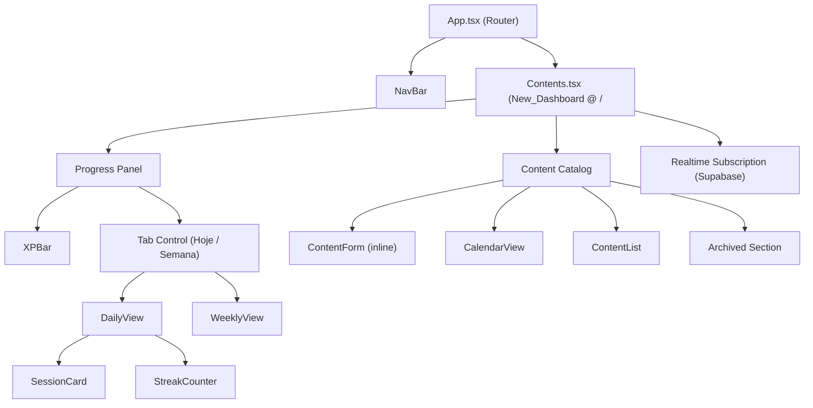
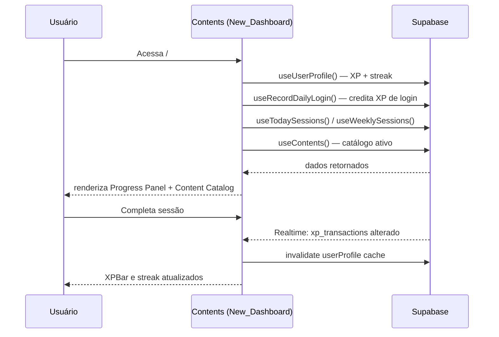

# Design Document — contents-as-dashboard

## Overview

Esta feature consolida as duas páginas principais do StudyFlow — **Dashboard** (`/`) e **Conteúdos** (`/contents`) — em uma única página unificada acessível pela rota raiz `/`.

Atualmente o usuário precisa navegar entre duas rotas para ter uma visão completa do seu progresso e do seu catálogo de estudos. A nova página (New_Dashboard) elimina essa fragmentação: o Progress_Panel (XPBar, StreakCounter, DailyView/WeeklyView) é incorporado diretamente acima do Content_Catalog existente.

A mudança é predominantemente de **reorganização de componentes e rotas** — nenhuma lógica de negócio nova é introduzida. Os hooks, componentes de gamificação e componentes de conteúdo existentes são reutilizados sem modificação. O que muda é:

1. A página `Contents.tsx` absorve os comportamentos de `Dashboard.tsx`.
2. A rota `/` passa a renderizar a nova página unificada.
3. A NavBar é atualizada para refletir a nova estrutura.
4. Os artefatos exclusivos do Dashboard antigo são removidos.

---

## Architecture

### Estrutura de Rotas (antes → depois)

```
Antes:
  /           → Dashboard.tsx   (XP, streak, missões)
  /contents   → Contents.tsx    (catálogo, calendário)

Depois:
  /           → Contents.tsx    (XP, streak, missões + catálogo, calendário)
  /contents   → removida (redirect para /)
```

### Diagrama de Componentes



### Fluxo de Dados



---

## Components and Interfaces

### `Contents.tsx` (New_Dashboard)

Arquivo existente que será expandido para incorporar o Progress Panel.

**Responsabilidades adicionadas:**
- Chamar `useUserProfile()` e `useRecordDailyLogin()` (atualmente em `Dashboard.tsx`)
- Renderizar `XPBar` acima do conteúdo principal
- Renderizar o controle de abas (Hoje / Semana) com `DailyView` e `WeeklyView`
- Manter a assinatura Realtime do Supabase para invalidar `userProfile`

**Props:** nenhuma (página de nível superior)

**Estado local adicionado:**
```typescript
const [activeTab, setActiveTab] = useState<'hoje' | 'semana'>('hoje');
```

**Hooks utilizados (completo após a mudança):**
```typescript
// Gamificação (novos para Contents.tsx)
const { data: userProfile, isLoading } = useUserProfile();
const recordDailyLogin = useRecordDailyLogin();

// Conteúdos (já existentes)
const [showForm, setShowForm] = useState(false);
const [editingContent, setEditingContent] = useState<Content | undefined>();
const { data: doneContents = [] } = useDoneContents();
const reopenMutation = useReopenContent();
```

---

### `NavBar.tsx`

**Mudança:** Atualizar o array `NAV_LINKS` para que o item "Conteúdos" aponte para `/` (com `end: true`) e remover o item "Dashboard".

```typescript
// Antes
const NAV_LINKS = [
  { to: "/", label: "Dashboard", end: true },
  { to: "/contents", label: "Conteúdos" },
  // ...
];

// Depois
const NAV_LINKS = [
  { to: "/", label: "Conteúdos", end: true },
  // "Dashboard" removido
  // demais itens inalterados
];
```

---

### `App.tsx`

**Mudança:** Remover a rota `/contents` (ou redirecioná-la para `/`) e garantir que `/` renderize `Contents`.

```typescript
// Antes
<Route path="/" element={<Dashboard />} />
<Route path="/contents" element={<Contents />} />

// Depois
<Route path="/" element={<Contents />} />
// rota /contents removida (o fallback * já redireciona para /)
```

---

### Componentes reutilizados sem modificação

| Componente | Caminho atual | Ação |
|---|---|---|
| `DailyView` | `components/dashboard/DailyView.tsx` | Mantido no caminho atual |
| `WeeklyView` | `components/dashboard/WeeklyView.tsx` | Mantido no caminho atual |
| `SessionCard` | `components/dashboard/SessionCard.tsx` | Mantido no caminho atual |
| `XPBar` | `components/gamification/XPBar.tsx` | Sem alteração |
| `StreakCounter` | `components/gamification/StreakCounter.tsx` | Sem alteração |
| `ContentList` | `components/contents/ContentList.tsx` | Sem alteração |
| `CalendarView` | `components/contents/CalendarView.tsx` | Sem alteração |
| `ContentForm` | `components/contents/ContentForm.tsx` | Sem alteração |
| `ContentCard` | `components/contents/ContentCard.tsx` | Sem alteração |

---

### Artefatos removidos

| Arquivo | Motivo |
|---|---|
| `src/pages/Dashboard.tsx` | Comportamentos migrados para `Contents.tsx` |

Os componentes `DailyView`, `WeeklyView` e `SessionCard` **não são removidos** — são reutilizados diretamente pela New_Dashboard em seus caminhos atuais.

---

## Data Models

Nenhum modelo de dados novo é introduzido. A feature opera inteiramente sobre os tipos e tabelas existentes.

### Tipos relevantes (sem alteração)

```typescript
// src/types/index.ts

interface UserProfile {
  totalXP: number;
  level: number;
  levelName: string;
  xpToNextLevel: number;
  currentStreak: number;
  longestStreak: number;
}

interface Content {
  id: string;
  userId: string;
  title: string;
  estimatedHours: number;
  completedHours: number;
  priority: "low" | "medium" | "high";
  status: "active" | "done" | "archived";
  deadline?: string;
  categoryId?: string;
  createdAt: string;
}

interface Session {
  id: string;
  userId: string;
  contentId: string;
  scheduledDate: string;
  plannedHours: number;
  status: "pending" | "done" | "skipped";
  completedAt?: string;
}
```

### Tabelas Supabase utilizadas (sem alteração de schema)

| Tabela | Uso |
|---|---|
| `contents` | Catálogo de módulos do usuário |
| `sessions` | Sessões de estudo diárias/semanais |
| `xp_transactions` | Histórico de XP para cálculo de nível |
| `streaks` | Sequência de dias consecutivos |
| `schedules` | Configuração de disponibilidade semanal |
| `categories` | Categorias para filtro do catálogo |

### Assinatura Realtime

A New_Dashboard mantém a mesma assinatura Realtime que o Dashboard atual:

```typescript
supabase.channel('dashboard-realtime')
  .on('postgres_changes', {
    event: '*', schema: 'public', table: 'xp_transactions',
    filter: `user_id=eq.${user.id}`
  }, () => queryClient.invalidateQueries({ queryKey: ['userProfile'] }))
  .on('postgres_changes', {
    event: '*', schema: 'public', table: 'streaks',
    filter: `user_id=eq.${user.id}`
  }, () => queryClient.invalidateQueries({ queryKey: ['userProfile'] }))
  .subscribe();
```

---

## Correctness Properties

*A property is a characteristic or behavior that should hold true across all valid executions of a system — essentially, a formal statement about what the system should do. Properties serve as the bridge between human-readable specifications and machine-verifiable correctness guarantees.*

### Property 1: XPBar exibe dados consistentes com o perfil do usuário

*Para qualquer* `UserProfile` válido retornado por `useUserProfile()`, os valores de nível, XP total e streak exibidos na New_Dashboard (via XPBar e StreakCounter) SHALL ser iguais aos valores presentes no perfil — sem transformação, truncamento ou perda de dados na camada de apresentação.

**Validates: Requirements 2.1, 2.3, 6.3**

---

### Property 2: Content Catalog exibe todos os conteúdos ativos sem perda ou duplicação

*Para qualquer* lista de conteúdos ativos retornada por `useContents()`, a New_Dashboard SHALL renderizar exatamente um `ContentCard` para cada conteúdo da lista — nem mais, nem menos.

**Validates: Requirements 3.1, 3.5**

---

### Property 3: Alerta de sobrecarga aparece se e somente se as horas estimadas excedem a capacidade semanal

*Para qualquer* par (totalHorasEstimadas, capacidadeSemanal), o alerta de sobrecarga SHALL ser exibido se e somente se `totalHorasEstimadas > capacidadeSemanal`. Quando `totalHorasEstimadas ≤ capacidadeSemanal`, o alerta SHALL estar ausente.

**Validates: Requirements 3.6**

---

## Error Handling

### Falha no carregamento do perfil do usuário

- `useUserProfile()` retorna `isLoading: true` enquanto carrega → exibir spinner acessível (mesmo comportamento do Dashboard atual)
- Em caso de erro, o React Query faz retry automático (3 tentativas por padrão)
- O Content_Catalog é independente do userProfile e continua funcional mesmo se o perfil falhar

### Falha no registro de login diário

- `useRecordDailyLogin` é uma mutation não-crítica; erros são silenciados (comportamento atual mantido)
- Não bloqueia a renderização da página

### Falha na assinatura Realtime

- Se o canal Supabase falhar, o XP e streak não atualizam em tempo real, mas os dados carregados inicialmente permanecem visíveis
- O cleanup do canal é feito no `useEffect` return para evitar memory leaks

### Navegação para rotas removidas

- A rota `/contents` é removida; o fallback `<Route path="*" element={<Navigate to="/" replace />} />` já existente em `App.tsx` garante o redirecionamento correto

### Testes existentes que referenciam Dashboard

- Os arquivos em `src/__tests__/` que referenciam `Dashboard.tsx` ou seus comportamentos devem ser atualizados para apontar para `Contents.tsx` (Requirement 5.4)

---

## Testing Strategy

Esta feature é predominantemente uma **reorganização de componentes e rotas** — não introduz lógica de negócio nova. A estratégia de testes reflete isso.

### Avaliação de PBT

A feature envolve mudanças de roteamento (React Router), composição de componentes existentes em uma nova página e atualização de links de navegação. A maioria dos critérios de aceitação são verificações de configuração, presença de elementos ou interações de UI específicas — não funções puras com espaço de entrada variável.

Há três propriedades identificadas como adequadas para property-based testing:
- **Property 1** (consistência XPBar ↔ userProfile): comportamento varia com os dados do perfil
- **Property 2** (catálogo sem perda/duplicação): comportamento varia com a lista de conteúdos
- **Property 3** (alerta de sobrecarga): comportamento varia com o par horas/capacidade

Para as demais, testes de componente com exemplos concretos são mais adequados.

**Biblioteca PBT:** [fast-check](https://fast-check.dev/) (já compatível com Vitest)

### Testes de Propriedade (fast-check + Vitest)

Cada teste de propriedade deve rodar mínimo **100 iterações**.

**Property 1 — XPBar exibe dados consistentes com userProfile**
```typescript
// Feature: contents-as-dashboard, Property 1: XPBar exibe dados consistentes com o perfil do usuário
fc.assert(fc.property(
  fc.record({
    totalXP: fc.integer({ min: 0, max: 100000 }),
    level: fc.integer({ min: 1, max: 20 }),
    levelName: fc.string({ minLength: 1 }),
    xpToNextLevel: fc.integer({ min: 0, max: 5000 }),
    currentStreak: fc.integer({ min: 0, max: 365 }),
    longestStreak: fc.integer({ min: 0, max: 365 }),
  }),
  (profile) => {
    // Renderizar New_Dashboard com useUserProfile mockado retornando profile
    // Verificar que XPBar exibe profile.totalXP e profile.level
    // Verificar que StreakCounter exibe profile.currentStreak
  }
), { numRuns: 100 });
```

**Property 2 — Content Catalog sem perda ou duplicação**
```typescript
// Feature: contents-as-dashboard, Property 2: Content Catalog exibe todos os conteúdos ativos sem perda ou duplicação
fc.assert(fc.property(
  fc.array(fc.record({
    id: fc.uuid(),
    title: fc.string({ minLength: 1, maxLength: 120 }),
    status: fc.constant('active'),
    // ... demais campos
  }), { minLength: 0, maxLength: 20 }),
  (contents) => {
    // Renderizar New_Dashboard com useContents mockado retornando contents
    // Verificar que o número de ContentCards renderizados === contents.length
    // Verificar que cada content.id aparece exatamente uma vez
  }
), { numRuns: 100 });
```

**Property 3 — Alerta de sobrecarga**
```typescript
// Feature: contents-as-dashboard, Property 3: Alerta de sobrecarga aparece se e somente se horas excedem capacidade
fc.assert(fc.property(
  fc.float({ min: 0, max: 200 }),  // totalHorasEstimadas
  fc.float({ min: 0.5, max: 168 }), // capacidadeSemanal
  (totalHoras, capacidade) => {
    // Renderizar ContentList com weeklyCapacityHours=capacidade e conteúdos somando totalHoras
    // Se totalHoras > capacidade: alerta deve estar presente
    // Se totalHoras <= capacidade: alerta deve estar ausente
  }
), { numRuns: 100 });
```

### Testes de Componente com Exemplos (Vitest + Testing Library)

**`Contents.tsx` (New_Dashboard):**
- Renderiza XPBar quando `useUserProfile` retorna dados
- Exibe spinner acessível quando `isLoading` é `true`
- Renderiza abas "Hoje" e "Semana"; clicar em "Semana" exibe WeeklyView
- Chama `useRecordDailyLogin` exatamente uma vez na montagem (não em re-renders)
- Renderiza CalendarView e ContentList abaixo do Progress Panel

**`NavBar.tsx`:**
- Exibe o item "Conteúdos" com `href="/"`
- Não exibe nenhum item com texto "Dashboard"
- Marca "Conteúdos" como ativo quando a rota ativa é `/`
- Mantém Categorias, Agenda, Perfil e Relatórios com suas rotas originais

**`App.tsx` (roteamento):**
- A rota `/` renderiza o componente `Contents`
- Rotas desconhecidas (ex: `/foo`, `/bar`) redirecionam para `/`

### Testes de Integração

- Mockar canal Supabase Realtime e verificar que eventos em `xp_transactions` e `streaks` disparam `invalidateQueries({ queryKey: ['userProfile'] })`

### Atualização de Testes Existentes

Os arquivos em `src/__tests__/` que importam ou referenciam `Dashboard.tsx` devem ser atualizados:
- `dashboard-bug-condition.test.tsx` → atualizar imports para `Contents.tsx`
- `dashboard-preservation.test.tsx` → atualizar imports para `Contents.tsx`
- Demais arquivos: verificar e atualizar referências conforme necessário
