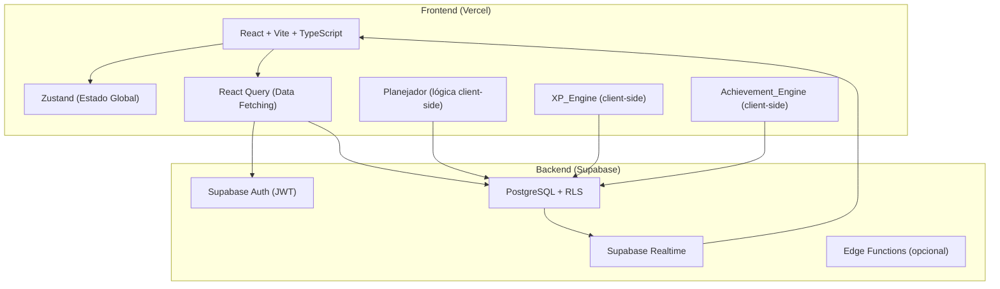
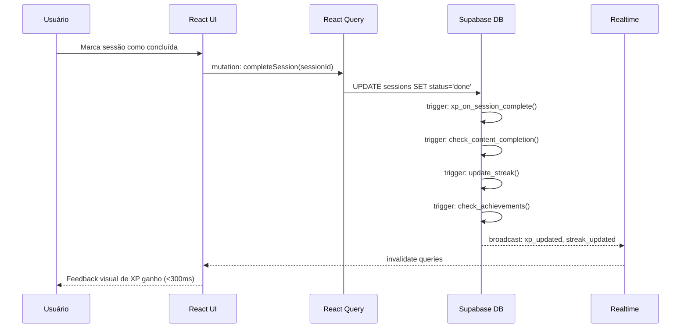
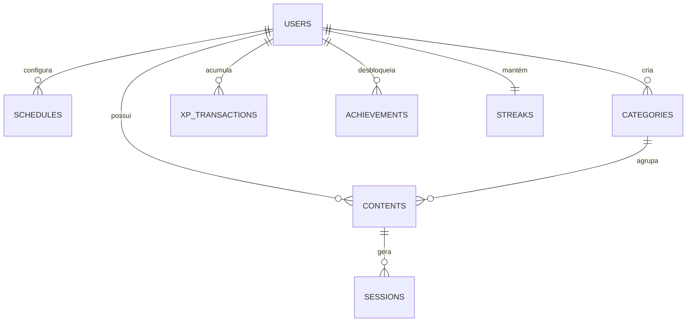

# Documento de Design — StudyFlow

## Visão Geral

O StudyFlow é uma plataforma web de gerenciamento de estudos que combina planejamento automático de sessões com gamificação para manter o engajamento do usuário. O sistema recebe conteúdos cadastrados pelo usuário, sua disponibilidade semanal e gera automaticamente um cronograma distribuído por prioridade e prazo.

A arquitetura é orientada a um backend-as-a-service (Supabase) com lógica de negócio concentrada no cliente (React + TypeScript), exceto pelas operações de banco de dados que utilizam funções PostgreSQL e triggers para garantir consistência transacional.

---

## Arquitetura

### Visão Geral da Arquitetura



### Fluxo de Dados Principal



### Decisões Arquiteturais

| Decisão | Escolha | Justificativa |
|---|---|---|
| Lógica do Planejador | Client-side (TypeScript) | Evita cold starts de Edge Functions; dados já estão em cache no React Query |
| Transações de XP | PostgreSQL triggers | Garante atomicidade; evita race conditions em múltiplas abas |
| Estado global | Zustand | Leve, sem boilerplate; adequado para estado de UI (sessão ativa, notificações) |
| Cache de dados | React Query | Stale-while-revalidate; invalidação granular por query key |
| Realtime | Supabase Realtime | Atualização de streak/XP em tempo real sem polling |

---

## Componentes e Interfaces

### Estrutura de Módulos Frontend

```
src/
├── components/
│   ├── auth/          # Login, Register, ProtectedRoute
│   ├── dashboard/     # DailyView, WeeklyView, SessionCard
│   ├── contents/      # ContentList, ContentForm, ContentCard, ProgressBar
│   ├── schedule/      # ScheduleConfig, DaySlot
│   ├── gamification/  # XPBar, LevelBadge, StreakCounter, AchievementCard
│   ├── reports/       # WeeklyReport, HoursBarChart
│   └── ui/            # Button, Input, Modal, Toast, Badge (design system)
├── hooks/
│   ├── useAuth.ts
│   ├── useSessions.ts
│   ├── useContents.ts
│   ├── useSchedule.ts
│   ├── useGamification.ts
│   └── useWeeklyReport.ts
├── lib/
│   ├── planner.ts         # Algoritmo de planejamento
│   ├── xp-engine.ts       # Cálculo de XP e níveis
│   ├── achievement-engine.ts  # Verificação de conquistas
│   ├── streak.ts          # Lógica de streak
│   └── supabase.ts        # Cliente Supabase
├── stores/
│   ├── authStore.ts       # Zustand: usuário autenticado
│   ├── notificationStore.ts  # Zustand: toasts de XP/conquistas
│   └── uiStore.ts         # Zustand: estado de UI (semana selecionada, filtros)
├── types/
│   └── index.ts           # Tipos TypeScript globais
└── pages/
    ├── Dashboard.tsx
    ├── Contents.tsx
    ├── Schedule.tsx
    ├── Profile.tsx
    └── Reports.tsx
```

### Interfaces TypeScript Principais

```typescript
// Conteúdo de estudo
interface Content {
  id: string;
  userId: string;
  title: string;           // max 120 chars
  description?: string;    // max 500 chars
  estimatedHours: number;  // min 0.5
  completedHours: number;
  priority: 'low' | 'medium' | 'high';
  deadline?: string;       // ISO date
  categoryId?: string;
  status: 'active' | 'done' | 'archived';
  createdAt: string;
}

// Sessão de estudo
interface Session {
  id: string;
  userId: string;
  contentId: string;
  scheduledDate: string;   // ISO date
  plannedHours: number;
  status: 'pending' | 'done' | 'skipped';
  completedAt?: string;
}

// Configuração da agenda semanal
interface ScheduleDay {
  dayOfWeek: 0 | 1 | 2 | 3 | 4 | 5 | 6; // 0=domingo
  isActive: boolean;
  availableHours: number;  // min 0.5, max 24
}

// Categoria
interface Category {
  id: string;
  userId: string;
  name: string;   // max 50 chars
  color: string;  // hex da paleta predefinida
}

// Transação de XP
interface XPTransaction {
  id: string;
  userId: string;
  amount: number;
  reason: string;
  sourceType: 'session' | 'content' | 'streak' | 'weekly_goal' | 'login' | 'content_creation' | 'early_completion';
  sourceId?: string;
  createdAt: string;
}

// Conquista desbloqueada
interface Achievement {
  id: string;
  userId: string;
  achievementKey: AchievementKey;
  unlockedAt: string;
}

type AchievementKey =
  | 'em_chamas'
  | 'devorador_de_livros'
  | 'maratonista'
  | 'pontual'
  | 'semana_perfeita'
  | 'madrugador';

// Perfil do usuário (estado derivado)
interface UserProfile {
  totalXP: number;
  level: number;
  levelName: string;
  xpToNextLevel: number;
  currentStreak: number;
  longestStreak: number;
}
```

### Interfaces dos Módulos de Lógica

```typescript
// lib/planner.ts
interface PlannerInput {
  contents: Content[];
  schedule: ScheduleDay[];
  existingSessions: Session[];
  horizonWeeks?: number; // padrão: 4
}

interface PlannerOutput {
  sessions: Omit<Session, 'id' | 'userId'>[];
}

function generatePlan(input: PlannerInput): PlannerOutput;
function rescheduleMissedSessions(missed: Session[], schedule: ScheduleDay[]): Session[];

// lib/xp-engine.ts
function calculateLevel(totalXP: number): { level: number; levelName: string; xpToNextLevel: number };
function getLevelThresholds(): { level: number; name: string; minXP: number }[];

// lib/achievement-engine.ts
interface AchievementCheckContext {
  userId: string;
  currentStreak: number;
  totalContentsCompleted: number;
  totalStudyHours: number;
  contentsCompletedBeforeDeadline: number;
  consecutivePerfectWeeks: number;
  earlyMorningSessions: number; // sessões concluídas antes das 07h
  unlockedAchievements: AchievementKey[];
}

function checkAchievements(ctx: AchievementCheckContext): AchievementKey[];
```

---

## Modelos de Dados

### Esquema do Banco de Dados (Supabase / PostgreSQL)

```sql
-- Agenda semanal do usuário
CREATE TABLE schedules (
  id          uuid PRIMARY KEY DEFAULT gen_random_uuid(),
  user_id     uuid NOT NULL REFERENCES auth.users(id) ON DELETE CASCADE,
  day_of_week smallint NOT NULL CHECK (day_of_week BETWEEN 0 AND 6),
  is_active   boolean NOT NULL DEFAULT false,
  available_hours numeric(4,2) CHECK (available_hours >= 0.5 AND available_hours <= 24),
  UNIQUE (user_id, day_of_week)
);

-- Categorias de conteúdo
CREATE TABLE categories (
  id      uuid PRIMARY KEY DEFAULT gen_random_uuid(),
  user_id uuid NOT NULL REFERENCES auth.users(id) ON DELETE CASCADE,
  name    text NOT NULL CHECK (char_length(name) <= 50),
  color   text NOT NULL  -- hex da paleta predefinida
);

-- Conteúdos de estudo
CREATE TABLE contents (
  id               uuid PRIMARY KEY DEFAULT gen_random_uuid(),
  user_id          uuid NOT NULL REFERENCES auth.users(id) ON DELETE CASCADE,
  category_id      uuid REFERENCES categories(id) ON DELETE SET NULL,
  title            text NOT NULL CHECK (char_length(title) <= 120),
  description      text CHECK (char_length(description) <= 500),
  estimated_hours  numeric(6,2) NOT NULL CHECK (estimated_hours >= 0.5),
  completed_hours  numeric(6,2) NOT NULL DEFAULT 0,
  priority         text NOT NULL CHECK (priority IN ('low', 'medium', 'high')),
  deadline         date,
  status           text NOT NULL DEFAULT 'active' CHECK (status IN ('active', 'done', 'archived')),
  created_at       timestamptz NOT NULL DEFAULT now()
);

-- Sessões de estudo
CREATE TABLE sessions (
  id              uuid PRIMARY KEY DEFAULT gen_random_uuid(),
  user_id         uuid NOT NULL REFERENCES auth.users(id) ON DELETE CASCADE,
  content_id      uuid NOT NULL REFERENCES contents(id) ON DELETE CASCADE,
  scheduled_date  date NOT NULL,
  planned_hours   numeric(4,2) NOT NULL CHECK (planned_hours > 0),
  status          text NOT NULL DEFAULT 'pending' CHECK (status IN ('pending', 'done', 'skipped')),
  completed_at    timestamptz
);

-- Transações de XP
CREATE TABLE xp_transactions (
  id          uuid PRIMARY KEY DEFAULT gen_random_uuid(),
  user_id     uuid NOT NULL REFERENCES auth.users(id) ON DELETE CASCADE,
  amount      integer NOT NULL,
  reason      text NOT NULL,
  source_type text NOT NULL CHECK (source_type IN (
    'session', 'content', 'streak', 'weekly_goal',
    'login', 'content_creation', 'early_completion'
  )),
  source_id   uuid,
  created_at  timestamptz NOT NULL DEFAULT now()
);

-- Conquistas desbloqueadas
CREATE TABLE achievements (
  id              uuid PRIMARY KEY DEFAULT gen_random_uuid(),
  user_id         uuid NOT NULL REFERENCES auth.users(id) ON DELETE CASCADE,
  achievement_key text NOT NULL CHECK (achievement_key IN (
    'em_chamas', 'devorador_de_livros', 'maratonista',
    'pontual', 'semana_perfeita', 'madrugador'
  )),
  unlocked_at     timestamptz NOT NULL DEFAULT now(),
  UNIQUE (user_id, achievement_key)
);

-- Streak do usuário
CREATE TABLE streaks (
  user_id         uuid PRIMARY KEY REFERENCES auth.users(id) ON DELETE CASCADE,
  current_streak  integer NOT NULL DEFAULT 0,
  longest_streak  integer NOT NULL DEFAULT 0,
  last_study_date date
);
```

### Políticas de RLS

Todas as tabelas possuem RLS habilitado. O padrão aplicado é:

```sql
-- Exemplo para a tabela contents (padrão replicado em todas as tabelas)
ALTER TABLE contents ENABLE ROW LEVEL SECURITY;

CREATE POLICY "users_own_contents" ON contents
  FOR ALL USING (auth.uid() = user_id);
```

### Diagrama de Relacionamentos



### Algoritmo do Planejador

O Planejador é executado no cliente (TypeScript puro) e opera sobre os dados já carregados via React Query.

```
ENTRADA: conteúdos ativos, agenda semanal, sessões existentes, horizonte (4 semanas)

1. ORDENAR conteúdos por:
   a. Prazo mais próximo (nulos por último)
   b. Prioridade: alta > média > baixa
   c. Menor quantidade de horas restantes (estimadas - concluídas)

2. PARA cada dia disponível no horizonte (próximas 4 semanas):
   a. Calcular horas já alocadas no dia
   b. Calcular horas disponíveis restantes = limite_dia - horas_alocadas
   c. PARA cada conteúdo na fila ordenada:
      - Calcular horas restantes do conteúdo
      - Calcular bloco = min(horas_restantes, horas_disponíveis_restantes)
      - SE bloco > 0 E conteúdo não foi alocado no dia anterior:
        * Criar sessão com planned_hours = bloco
        * Decrementar horas_disponíveis_restantes
        * Decrementar horas_restantes do conteúdo
      - SE horas_disponíveis_restantes == 0: avançar para próximo dia

3. RETORNAR lista de sessões geradas
```

### Tabela de Níveis e XP

| Nível | Nome | XP Mínimo |
|---|---|---|
| 1 | Iniciante | 0 |
| 2 | Estudante | 500 |
| 3 | Dedicado | 1.500 |
| 4 | Focado | 3.500 |
| 5 | Expert | 7.500 |
| 6 | Mestre | 15.000 |

